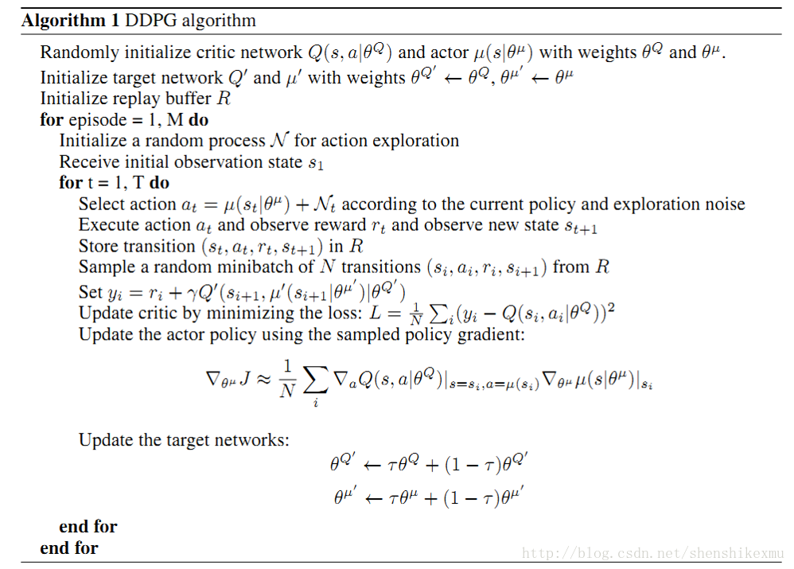

# ddpg
ddpg(Deep Deterministic Policy Gradient) algorithm

## Dependency
tensorflow >= 1.4

## Introduction
Consider :    
**Critic** : (state,action)  -> q value(scalar) goodness of action   
**Actor** : state -> action   

Deterministic policy :  
Action Value function :   
Critic network is q function(action-value function),giving the goodness of actor.  Training critic network close to the fact (real reward), and supply gradient for actor update.Critic judge the actor is real(close the fact ) or fake(depart from the fact).
Policy network update action policy by replay and giving the best action. Actor always try to get the biggest reward.

## Algorithm

